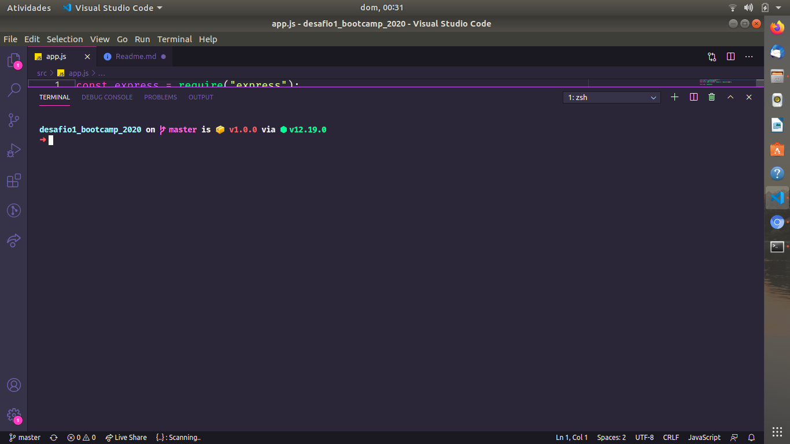
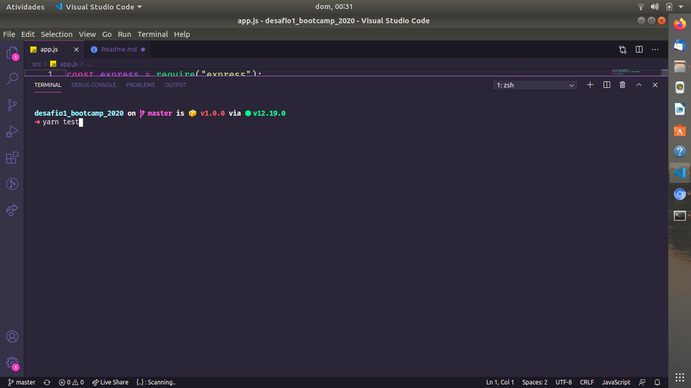
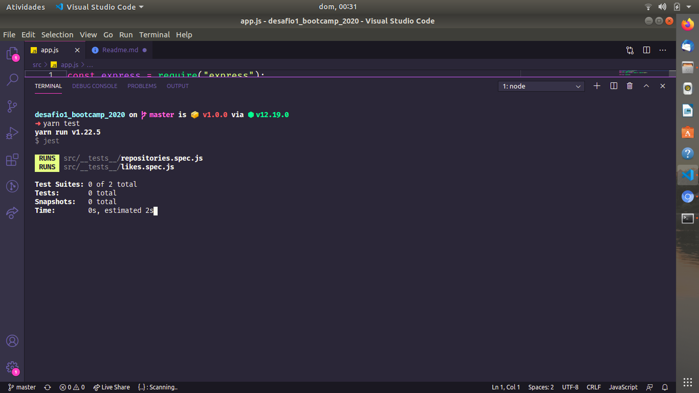
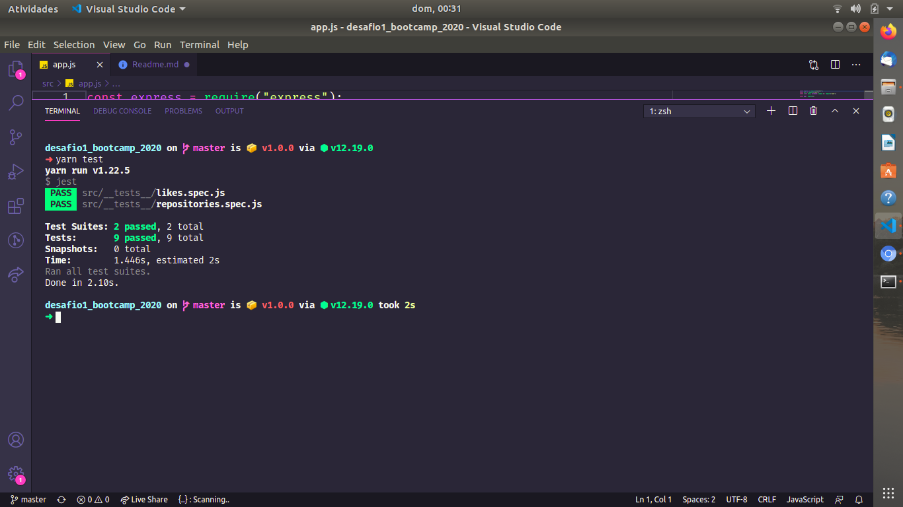

  

<h3 align="center">
  Desafio 02: Conceitos do Node.js
</h3>

<blockquote align="center">“Não espere para plantar, apenas tenha paciência para colher”!</blockquote>

  

  

  

  

  <a href="#rocket-sobre-o-desafio">Sobre o desafio</a>&nbsp;&nbsp;&nbsp;|&nbsp;&nbsp;&nbsp;
  <a href="#calendar-entrega">Entrega</a>&nbsp;&nbsp;&nbsp;|&nbsp;&nbsp;&nbsp;
  <a href="#memo-licença">Licença</a>

  
Desafio solucionado para o bootcamp!!! 

  
construido todas as rotas HTTP

    ### GET -> Para listar dados
    ### Post -> Para Criar dados
    ### PUT -> Para Alterar dados menos os de "LIKES"
    ### DELETE -> Para deletar dado através do ID.
  

  ### Caso queira baixar os arquivos

  #### Faça uma branch e execute os seguintes passos
  
Abra o terminal da sua máquina 

  
 git clone "url-do-arquivo" 

  
 execute o comando yarn install 

  
 Agora navegue até a pasta cd "Nome-da-pasta" 

  
 Execute o comando code . 

  #### Pronto agora a pasta com os arquivos estára dentro no seu editor e poderá utilizar.

  ##### Caso queira contibuir com melhoras no código faça uma branch e atualize ficarei feliz em revisar o código.

  ### Desafio in developer
  

    <h1>Desafio baseado em teste"</h1>
    <ul>
      <li><li>
      <li><li>
      <li><li>
      <li><li>
    </ul> 
  

Here are some ideas to get you started:

- 🌱 I’m currently learning ...
- 👯 I’m looking to collaborate on ...
- 🤔 I’m looking for help with ...
- 💬 Ask me about ...
- 📫 How to reach me: ...
- 😄 Pronouns: ...
- ⚡ Fun fact: ...
-->